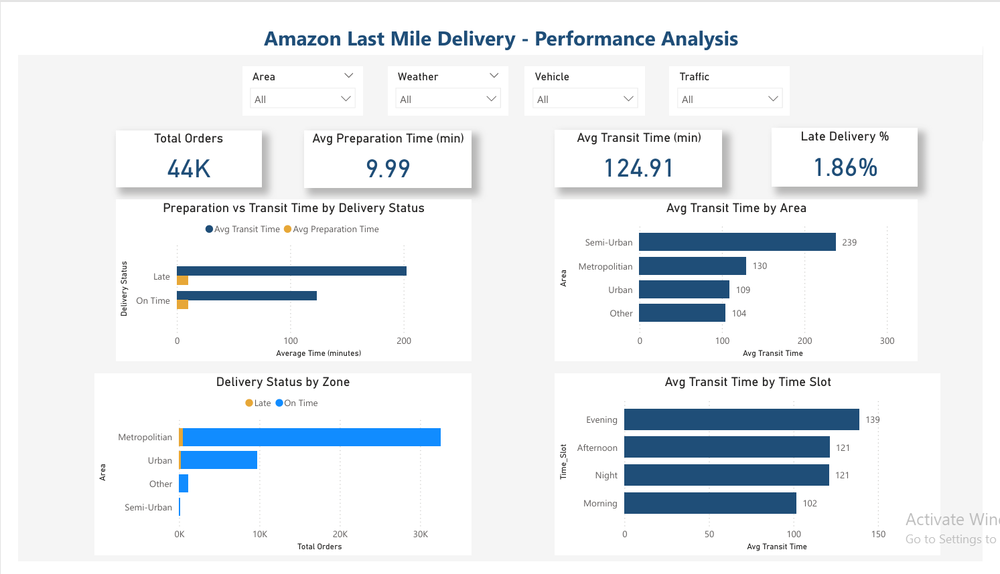
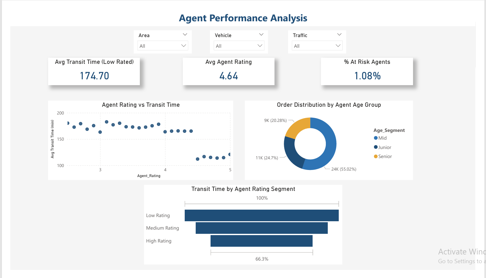
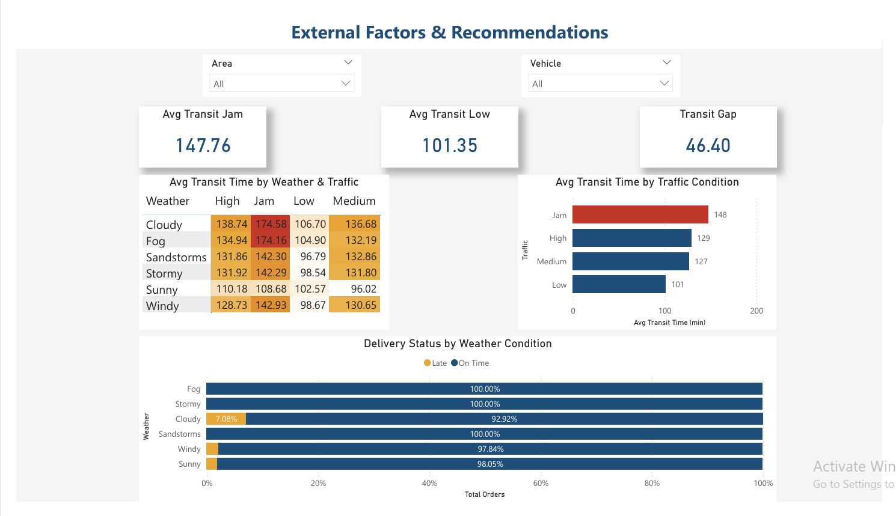

# Amazon Last Mile Delivery — Performance Analysis

**Core Question:** Is Preparation Time or Transit Time the bigger driver of Amazon's last mile delivery delays?

End-to-end business analysis of 43,648 Amazon delivery records using SQL, Power BI, and n8n automation. Identifies root causes of delivery delays across zones, agents, and time slots with actionable recommendations for operations teams.

---

## Dashboard Preview

**Executive Summary**


**Agent Performance**


**External Factors**


Full dashboard: [Last_Mile_Delivery_Dashboard.pdf](dashboard/Last_Mile_Delivery_Dashboard.pdf)

---

## Key Findings

| Finding | Insight |
|---------|---------|
| Transit Time is the problem | Late deliveries average 202 mins transit vs 123 mins on-time — a 64% difference. Preparation time is identical (~10 mins) regardless of outcome. |
| Semi-Urban zones are critical | Semi-Urban has the highest avg transit time at 238 mins — 2x higher than Urban (109 mins). |
| Traffic beats weather | Jam traffic adds 46+ mins regardless of weather condition. |
| Senior agents underperform | Senior agents (35+) average 140 mins vs 109 mins for junior agents — a 28% gap. |
| Evening is the worst slot | Evening orders (5–9PM) average 139 mins vs 102 mins for morning orders. |

---

## Tech Stack

| Tool | Purpose |
|------|---------|
| Google Sheets | Data cleaning and calculated columns |
| MySQL | SQL-based business question analysis |
| Power BI | Interactive 3-page KPI dashboard |
| n8n | Automated weekly delivery performance alerts |
| GitHub | Project documentation and version control |

---

## Repository Structure

```
amazon-last-mile-delivery-analysis/
│
├── README.md
├── cleaned_data/
│   └── deliveries.csv
├── sql/
│   └── analysis_queries.sql
├── docs/
│   ├── BRD_Amazon_Delivery.pdf
│   └── Insights_Amazon_Delivery.pdf
└── dashboard/
    ├── Last_Mile_Delivery_Dashboard.pbix
    └── Last_Mile_Delivery_Dashboard.pdf
```

---

## Business Questions Answered

**Q1 — Operational:** Which zones have the highest average transit time?
Semi-Urban zones take 238 mins on average — 2x longer than Urban zones at 109 mins.

**Q2 — Agent Performance:** Do lower rated agents take longer to deliver?
Low-rated agents average 174 mins vs 115 mins for high-rated agents — a 50% difference.

**Q3 — Time and External Factors:** Which time slots and conditions drive delays?
Evening (5–9 PM) is the worst slot. Traffic Jam is the dominant external factor, more impactful than weather.

**Q4 — Business Impact:** Which zones have the highest late delivery rate?
Other (2.55%) and Urban (2.43%) have the highest flagged late rates. Semi-Urban shows 0% due to a structural limitation in the late delivery definition — see insights document for details.

---

## Dataset

- **Source:** Amazon Delivery Dataset (Kaggle)
- **Records:** 43,648 deliveries
- **Period:** February – April 2022
- **Zones:** Urban, Metropolitan, Semi-Urban, Other

**Calculated Columns Added:**

| Column | Definition |
|--------|-----------|
| Preparation_Time | Pickup_Time minus Order_Time in minutes |
| Transit_Time | Delivery_Time column — minutes from pickup to drop |
| Late_Delivery_Flag | Late if Delivery_Time exceeds 1.5x area average under normal traffic and weather |
| Time_Slot | Morning / Afternoon / Evening / Night based on Order_Time |
| Age_Segment | Junior under 25 / Mid 25–35 / Senior over 35 |
| Rating_Segment | High above 4.5 / Medium 3.5–4.5 / Low below 3.5 |

---

## Recommendations

1. Focus all improvement efforts on Transit Time reduction — preparation time is not the bottleneck
2. Implement real-time traffic routing — Jam traffic adds 46+ mins and has the highest ROI for intervention
3. Increase agent staffing during Evening (5–9PM) peak window
4. Expand warehouse presence and agent network in Semi-Urban zones
5. Provide digital literacy training and pre-planned routes for Senior agents (35+)
6. Create a separate late delivery benchmark for Semi-Urban zones

---
